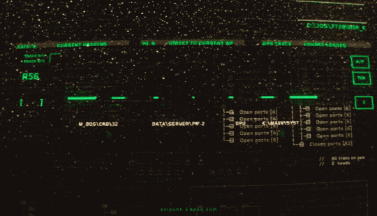

# João Pedro Mourinha

Computer Science student at Cesar School, transitioning from Design.
Passionate about technology and Red Hot Chili Peppers 🎸

---

### About me

- 🎓 1st semester — Computer Science @ Cesar School
- 🔐 Self-studying Cybersecurity through CTF challenges
- 🤖 Interested in AI, Data Engineering and how they intersect
- 🎨 Design background — I care about how things look and feel
- 📍 Olinda, PE — Brazil

---

### Tech Stack

---

### Projects

| Project | Description | Stack |
|---------|-------------|-------|
| [Portfólio](https://mourinhajp.github.io/Portif-lio-Mourinha/) | Personal portfolio with animations, i18n and a 3D Spline scene | HTML, CSS, JS |
| [HyroxPlanner](https://github.com/felipeassiss/HyroxPlanner) | CLI system for managing HYROX training with an AI agent powered by Groq | Python, Groq AI |
| [Bloom](https://sites.google.com/cesar.school/bloom?usp=sharing) | Course management system for a social impact NGO | Team Project |

---

### Certifications

- JavaScript Essentials 1 — Cisco Networking Academy
- Introduction to Git and GitHub — Google / Coursera
- Python for Data Science, AI & Development — IBM / Coursera

---

### Stats

  

---

### Contribution Snake

<picture>
  <source media="(prefers-color-scheme: dark)" srcset="https://github.com/MourinhaJP/MourinhaJP/blob/output/github-snake-dark.svg" />
  <source media="(prefers-color-scheme: light)" srcset="https://github.com/MourinhaJP/MourinhaJP/blob/output/github-snake.svg" />
  
</picture>

---

### Find me

